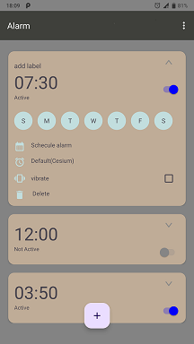

# Alarm Project

A simple alarm application built for Android that allows users to set, schedule, and manage alarms with ease. The project utilizes `RecyclerView` to display a list of alarms.

## Features

- **Set Multiple Alarms**: Users can create multiple alarms with custom times.
- **Repeat Options**: Each alarm can be set to repeat on specific days of the week.
- **Vibration**: Alarms can trigger vibrations based on user preferences.
- **Alarm Tone**: Default tone settings for each alarm.
- **RecyclerView**: Efficiently displays alarms in a scrollable list.
- **User Interface**: Clean and minimal design for a smooth user experience.

## Screenshots



## Getting Started

Follow these instructions to set up and run the project on your local environment.

### Prerequisites

- Android Studio installed
- Java Development Kit (JDK) version 8 or higher

### Installation

1. Clone the repository:
   ```bash
   git clone https://github.com/yourusername/your-alarm-project.git
